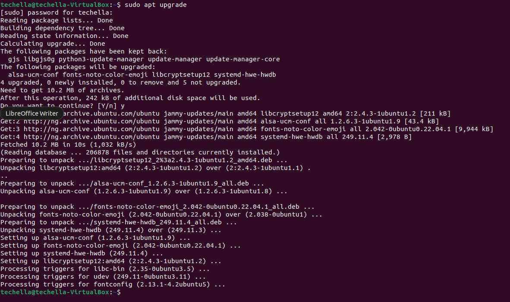
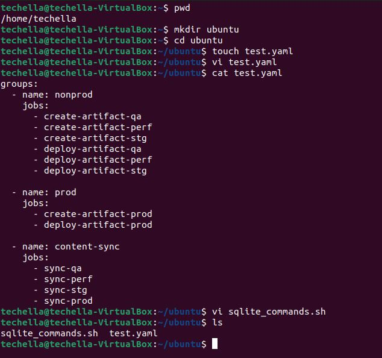
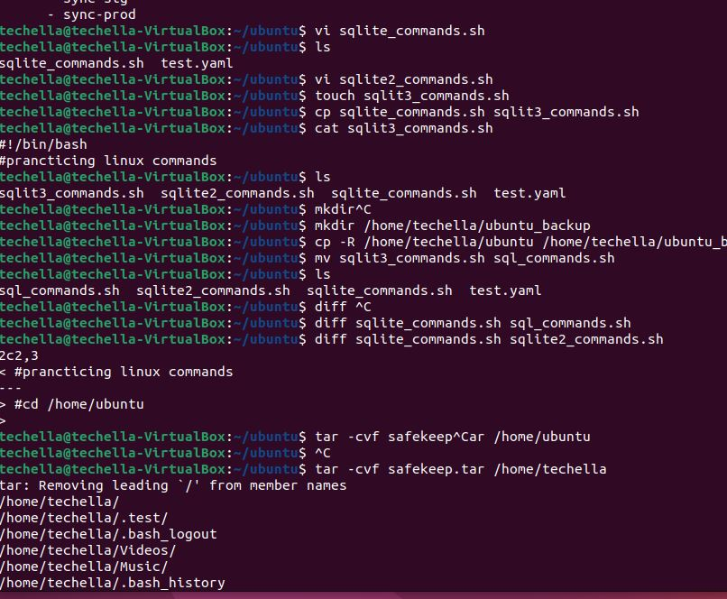

## This is a doc story line for the Darey.io Linux Project 1 ##
## After study of the commands kindly see how I implemented them to practice below ##
+  Firstly, we will use `sudo apt update` to make sure our OS is updated
  

+ Started with creating a directory called ubuntu and also added yaml and bash files
  

+ I also created copy on the file and renamed them, the zipped my hy home directory

