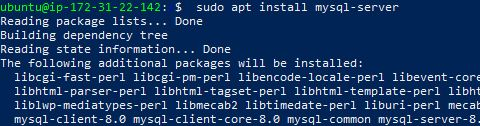
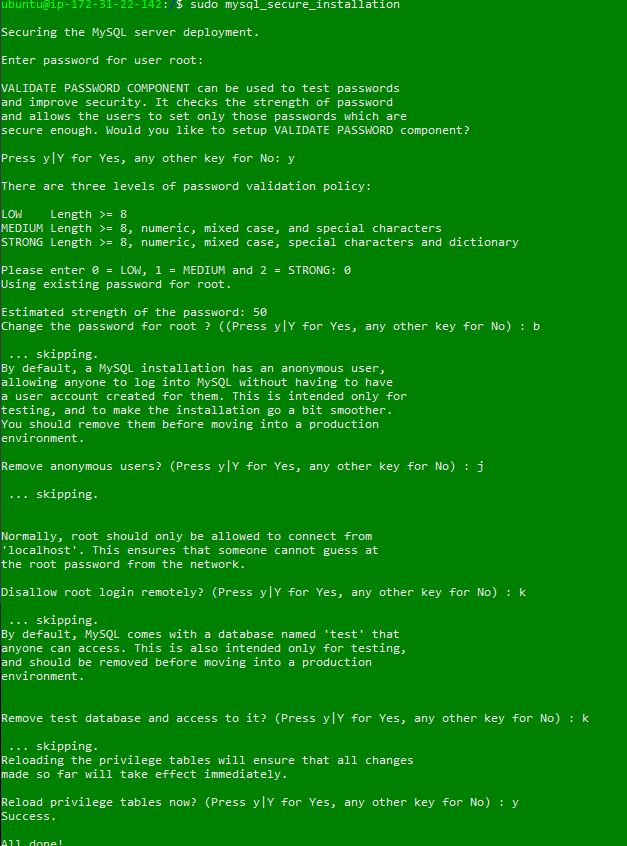
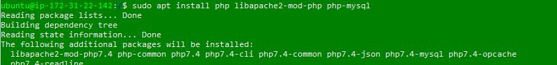
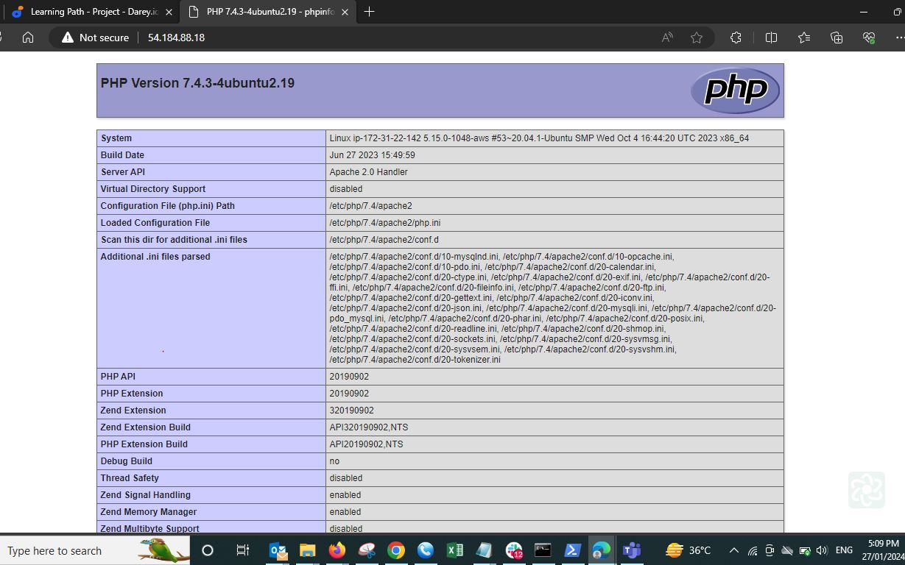

# Webstack Implementation `The LAMP stack` 
#### Aim: To deploy a website with its running tools on a dedicated webserver
####Tools :  AWS, Apache, MySql sever and PHP , openssh
` Note: this task will be deployed using an AWS cloud provisioned EC2 Instance(ubuntu) `
#### We are going to create a key pair using it as a 2 way authentication between our local PC and the ubuntu ec2 instace we cretate on AWS 
`Note if you will be using  openssh on powershell always generate a .pem key pair`

####Setting up your local windows PC to connect(SSH) to your AWS EC2 instance: Click this link to get a guide to install openssh; https://docs.aws.amazon.com/AWSEC2/latest/UserGuide/openssh.html#openssh-install . This tool will be used in powershell to connect to to the EC2 instance . Also see how to connect to your instance here https://docs.aws.amazon.com/AWSEC2/latest/UserGuide/openssh.html

Connect to your instance `ssh -i <private-key-name>.pem ubuntu@<Public-IP-address>` 

#### update a list of packages in package manager `sudo apt update` then run apache2 package installation `sudo apt install apache2` and check apache is running using `$ sudo systemctl status apache2`

#### test connection after setting up security rulles for https  `curl http://localhost:80` then go to your PC browser and query the address `http://ipaddress:80`, see the reult below;

#### Next  we install mysql server `sudo apt install mysql-server` then log in using the default usser root `sudo mysql`. Now we want to set a password for user root , everytime we log in to my mysql using this query `ALTER USER 'root'@'localhost' IDENTIFIED WITH mysql_native_password BY 'PassWord.1';` then validate the password you set `sudo mysql_secure_installation` To exit mysql use this `exit`

#### Once we are set with apache and mysqlserver , we will go ahead to install php. for PHP we have 3 packages to set up for this webserver, one package to set up php files `php`, a second packe which manages connection to the DBMS(mysqlserver) `php-mysql`and a package that lets apache parse php files to be read on the webpage `lipapache2-mod-php`. run `sudo apt install php libapache2-mod-php php-mysql` after the installation process is finished . check version using this command `php -v`

#### Our next goal is to get our webserver to display a .html or php file . 
+ Create a directory in the /var/www called project lamp `sudo mkdir /var/www/projectlamp` then give ownership of this directory to the current user using `sudo chown $USER:$USER /var/www/projectlamp` .
+ We will also go ahead to create a html or php file. I will be using a php file for this task so `sudo vi /var/www/projectlamp/index.php` 
#### To make this possible for apache to parse  we will need to set up a virtual host by creating a virtuual host configuration file here `sudo vi /etc/apache2/sites-available/projectlamp.conf` . Enable the virtual host `sudo a2ensite projectlamp`, disable the default apache site `sudo apache2ctl configtest`  then we reload  apache `sudo systemctl reload apache2`.
Enabling php is vital to complete this step so that the website checks it record of files to parse for viewing on the website , we enable files in this path /etc/apache2/mod-enabled/dir.conf  . We will edit this file to add the name of the file (index.php) we just added to be viewed on the website 
`<IfModule mod_dir.c>
        #Change this:
        #DirectoryIndex index.html index.cgi index.pl index.php index.xhtml index.htm
        #To this:
        DirectoryIndex index.php index.html index.cgi index.pl index.xhtml index.htm
</IfModule>`
now we refresh the address on our browser

