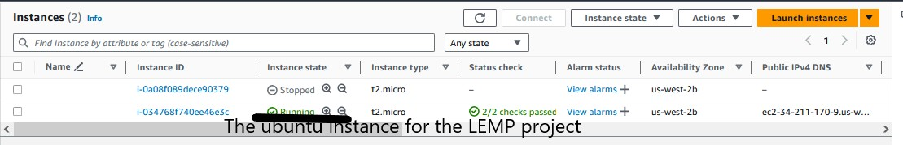
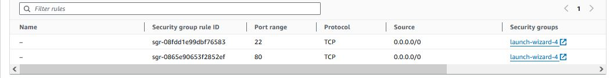
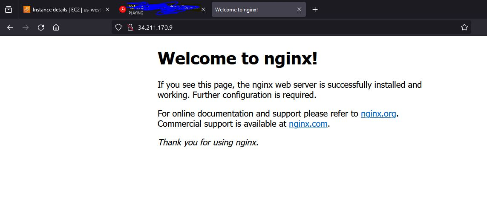
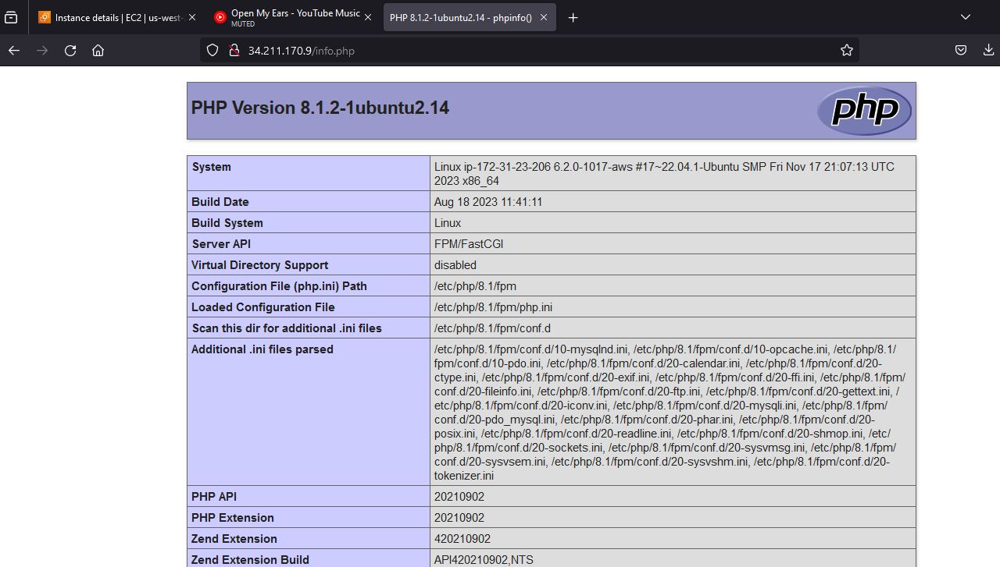
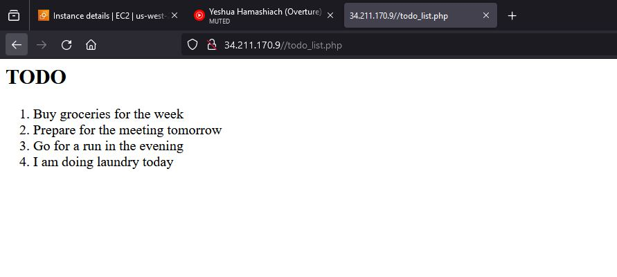

## Webstack Implementation (LEMP)
Note : The whole command line process can be found in this path 
 https://github.com/Coffeedcognac/DareyIO_Projects/blob/main/PRJCT_2/prjct_img/lemp_doc.txt 
#### Linux, EngineX(nginx), Mysqlserver,PHP.
`We will be using Gitbash as the SSH client and AWS provided ubuntu EC2 instance for this task`
##### Provision your server and ssh into it using Gitbash
#### Make sure to be in the directory where the .pem file is located or be sure to provide the entire path to were the .pem file is saved, see below.

` ssh -i path/to/your/abc.pem ubuntu@your.public.ip.address`
#### I also went to my working directory . Luckily Gitbash sort of functions like our usual linux terminal so we can `pwd`(point your working directory) on it ; this is to make sure that we are on the same path where our .pem keypair is stored and run
`ssh -i abc.pem ubuntu@your.public.ip.address`
#### This connects you to your instance and now we we will update our default apps and drives with `sudo apt update` and move on to provision our nginx webserver by installing with `sudo apt install nginx` also checj if status is set to active and running with a green colour using this command `sudo systemctl status nginx`
#### We will proceed to activate port 80 on our ubuntu instance to allow http traffic inbound

Run the curl command to your host machine (ubuntu istance )to test for connectivity; `curl https://127.0.0.1:80`
if the response returns a html formatted text content , it means the connection is valid. We will return to the PC browser and query `https://your.public.ip.address:80`. it should look like this webpage below

### Setup Mysql Server
#### We will install the DBMS to be used which is **mysqlserver** using this command `sudo apt install mysqlserver` and default log into the dbserver usng `sudo mysql` . we will set up a password for the root user and carry out the validation process using `sudo mysql_secure_installation`
see the whole process for this processes here https://github.com/Coffeedcognac/DareyIO_Projects/blob/1a4b14c8dd0f27bce5979132657a9acefa242afa/PRJCT_2/prjct_img/lemp_doc.txt#L611C1-L700C56

### Set up NGINX to use PHP processor 
#### For this task, two packages will be installed `php-fpm` and `php-mysql`. Unlike Apache which embed a php interpreter for each request, Nginx usually calls an external program which acts as a bridge between the interpreter and the webserver.
#### The entire set up for this process can be seen here but before that , let us test with a info.pho file to make sure our webserve can parse php files. We will create a directory at the root of the web directory  and give ownership of this file to the current user  with the folowng commands
`sudo mkdir /var/www/projectLEMP `
`sudo chown -R $USER:$USER /var/www/projectLEMP`
#### We will go ahead to create a `projectLEMP` configuration file to set up listening ports, root directory were files are loaded from, define index files and location of filetypes.
We will write into a new file in this path  `/var/www/projectLEMP` called info.php and reload
https://github.com/Coffeedcognac/DareyIO_Projects/blob/c016c4d94aef6589717592668868d4bdd97639aa/PRJCT_2/prjct_img/lemp_doc.txt#L700C1-L835C1

I also created  a new db created a table  to so list and inserted values into it . to be written in a todo.php file when a request is made from your browser https://github.com/Coffeedcognac/DareyIO_Projects/blob/main/PRJCT_2/prjct_img/lemp_doc.txt#L924

