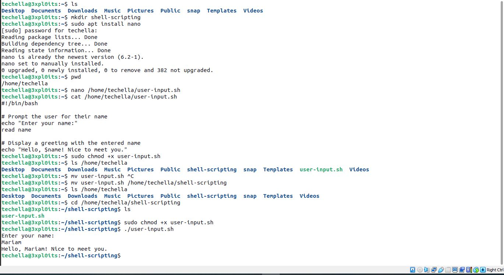
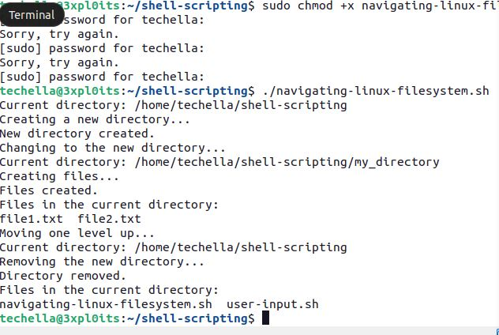
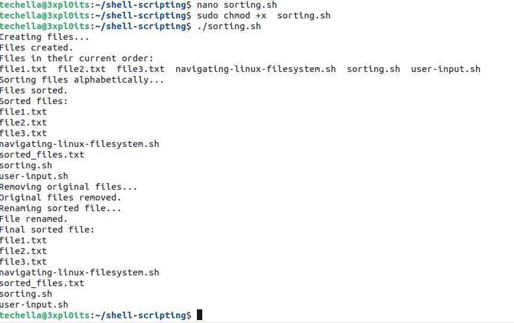
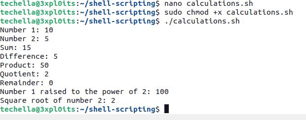
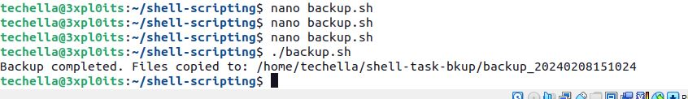

# Introduction to Shell Scripting and user input
## Notes
#### What are Bash Scripts? These are a series of command like instructions that are executed in a sequenntial manner. its basically like arranging numbers in a descending or ascending order and calling them as they are arranged . The .sh extension signifies the file type for a bash script also noting to make this file executable with the `chmod +x` command (Never forget the almighty SUDO).

## Shell Scripting Syntax Elements
#### 1. Variables: We can assign or define variables using the `equal to  sign (=) ` and also Print a value using the `echo` command in a shell script.
#### 2. Control flow: These are basically like conditional statements to control the flow in your scripts. Example of these are 

#### `if [ condition ]; then`
    # commands to be executed if the condition is true
#### `elif [ another_condition ]; then`
    # commands to be executed if another_condition is true
#### `else`
    # commands to be executed if none of the conditions are true
#### `fi`

#### 3 . Command Substitution: This is like assigning a variable to a command with a specific output. lets say, we will like to include in our script to datestamp a file with a particular date format. we know the command to print the present date on our terminal to be `date`.
#### See this sample; curent_date = `date %Y-%m-%d`  or `curent_date = $date (%Y-%m-%d)`
The above is asking the value for  `date` command with its format specifier to be assigned to the variable `current_date`.
Note : this can be don with backticks`` or $()

#### 4. Input and Output : In shell |Scripting we often have to make provision for human input and system output. We use the `read` command to specify that human input is required and `echo` to out put a required response which ould usually be a text . We also can input froma file using `<` and output from a file using `>`. 

#### 5. Functions: We could modularise our code in bash scripts to make it more reusable. This means you can define the  a function by grouping a set of commands and creating it as a module to be used in another scripts when needed.

#### See samples of writen scripts below

## Writing our first Shell script (commented each line)

## Directory Manipulation and Navigation

## File Operations and sorting

## Working with Numbers and Calculations

## File Backup and Timestamping

